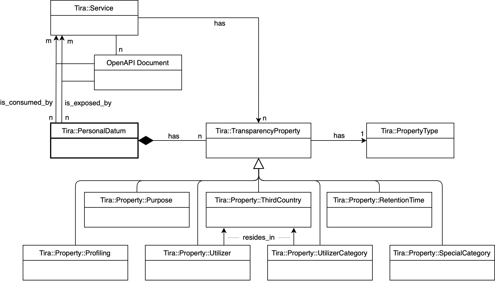

# Vocabulary

The vocabulary consists of several entities whose logical structure is depicted above.
If a schema is marked
as *PD indicator*, our extension will instantiate a
`Tira::PersonalDatum` object related to it. Attached to this object can
be instances of `Tira::TransparencyProperty` which have a type. Each of
these, in turn, represents one vocabulary entity. In general,
`TransparencyProperties` can be attached to a personal data item in
several ways within an OpenAPI document: Either they are incorporated
directly by extending the schema or they might as well be integrated on
a higher level, e.g. for operations or pathItems, in which personal data
is obtained or passed on, or at document level. Each vocabulary item is
represented by a subclass of the `Tira::TransparencyProperties` class.

To illustrate how the vocabulary is used in practice, we recall our
application scenario from the paper. We
might want to further annotate the API specification of our PostgreSQL
database to show exemplary behaviour. In the paper, we show how a **storage
period** according to Art. 13(2a), 14(2a), 15(1d), and 30(1f) can be expressed.
First of all, the storage period itself can be set. Developers can then express
for how long the documented endpoint saves data via a `days`, `months`
and `years` variable. If the storage is volatile or unlimited in time,
this can also be set in respective variables. Moreover, the GDPR also
allows storage time limits to be ensured by periodic reviews (cf.
Recital 39). Whether these reviews are taking place and, if that is the
case, in which frequency can also be set for the storage period
vocabulary element. Taken as whole, the extended API specification
effectively communicates the required transparency information with
regards to storage periods.

For now, we took the vocabulary element of `RetentionTime` as an
extensive example. All other vocabulary elements follow the same general
approach. We will now – due to space constraints – *briefly* introduce
the other vocabulary elements and highlight selected details of their
expressiveness (see Req. 1 from our paper).

**Recipients:** As we are considering a REST context, recipients are
mainly defined by the responses of a request. Alternatively, data is not
shared directly with a third party but the whole service is implicitly
disclosing data (e.g. because of its hosting situation). The
`direct_transfer` variable expresses the latter relation. Otherwise the
`Utilizer` element captures the identifying name of the recipient and
the residing country respectively. The latter is achieved by embedding a
`ThirdCountry` vocabulary element inside the `Utilizer` element.
Additional contact information can be entered in the *TransparencyHub*,
which also offers a way for grouping different notations of a utilizer.
The notion of categories of recipients is also possible through a designated
`utilizer_category` field.

**Third country:** Using this vocabulary item, a developer can express
whether data will be transferred to other countries, most notably non-EU
countries. This vocabulary item can be set for *(i)* a whole service,
*(ii)* responses or for *(iii)* the `Utilizer` and `UtilizerCategory`
elements, as recipients may reside in third countries.

**Special category:** Via this item
developers can mark that data is of a special category according to Art.
9 GDPR. Incorporating the element is sufficient for declaring a personal
datum as *special* but a category must be given which should map to the
defined special categories of the GDPR. Alternatively, *PD indicators*
can also be marked as *special* in the *TransparencyHub*, overriding
possible discrepancies.

**Profiling:** This vocabulary item allows to declare the existence of
profiling in the context of automated decision making. Additionally, a
reason must be given to allow for further legal classification. Both,
the `SpecialCategory` and the `Profiling`, items describe the whole
service.

**Purposes:** In order to express purposes, we have incorporated an
already established technology specifically devoted to this context: We
integrated YaPPL – a “formal representation of consent in the sense of
the GDPR” – which offers a “representation of possible processing
purposes”. We utilized the `permitted` field of YaPPL to list the
purposes for which legally relevant processing is happening. The
combination and grouping of purposes can be done in the
*TransparencyHub*.

Using each of the aforementioned vocabulary elements, a developer can
also **annotate properties of the service itself**. Invoking any element
of the extension on the service level semantically applies all
processing properties to the possible constellations in OpenAPI
specifications. This
feature also significantly facilitates the process of describing third
party services that impose complex processing activities that need to be
represented in a distributed system environment. This fact aligns well
with the need for service-focused approaches (Req. 2) and the dynamic
integration across service hierarchies (Req. 3).

So far, we introduced the vocabulary elements necessary to cover the
transparency obligations for *PD indicators* in different constellations
within the OpenAPI specification. The modular design of our vocabulary allows for future
extensions. For instance, by adding more `TransparencyProperties`,
information obligations with even higher granularity can be expressed.
In the following section, we will now focus on system-wide transparency
obligations introducing the TransparencyHub already hinted at above.